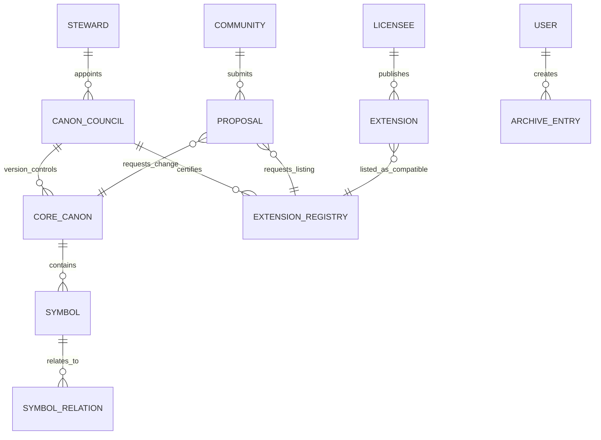
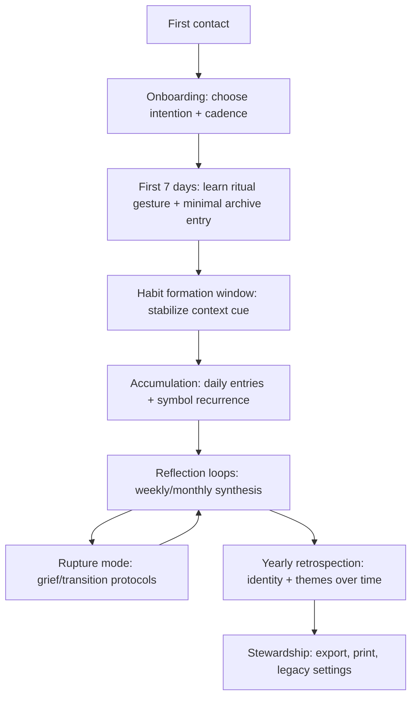
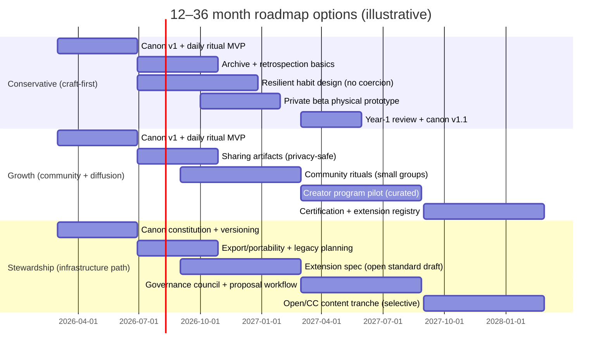

# Deep Research: Long-Term Vision Questions

1. What kind of company does this become — a product studio, a single app, a ritual platform?
2. What would it mean for this product to be considered cultural infrastructure — is that the ambition?
3. Could the symbolic system ever be licensed or adapted by other creators, and would that dilute or expand the mission?
4. What does the product look like for someone who has used it every day for three years — what has accumulated?
5. Is there a version where the system learns and grows alongside the user, or does that compromise the integrity of the symbols?
6. What is the relationship between this product and death, grief, or major life rupture — is it appropriate there?
7. If the product becomes beloved, what is the theory of how it spreads — word of mouth, ritual communities, something else?
8. How do you want to feel about this product in ten years — proud of the craft, proud of the reach, or something else?
9. Is there a version of this that becomes a physical object — a deck, a journal, something that exists outside screens?
10. What happens to the product if you step back — is it designed to outlast your direct involvement?

# Long-Term Vision for a Symbolic Ritual Product System

## Executive summary

A symbolic ritual product can become (a) a **single, opinionated app**, (b) a **ritual platform** (a protocol + archive + governance layer that others can build on), or (c) a **product studio** that repeatedly ships multiple ritual products using one shared symbolic grammar. The strongest pattern across “things that become infrastructure” is that they stabilize a set of **shared conventions** (symbols, rules, interfaces) and then become **quietly embedded** in other people’s lives and workflows—often through standards-like governance and reliability rather than continual novelty. This mirrors how infrastructure is typically characterized in sociotechnical research: it becomes “invisible” through embedding, learned membership, and dependable conventions. citeturn2search38turn2search3turn3search10

For the ten questions you asked, the most evidence-aligned direction is usually **sequenced**, not binary: start as a **single app** to protect coherence and prove daily value, while designing the **symbolic canon and data model** as if it will later be a **platform/protocol**. This “platform later” stance reduces the most common failure mode in ritual products: expanding surface area before the ritual is strong enough to carry meaning, community, and reuse. Platform strategy research emphasizes that platforms demand different governance and metrics than pipeline products; prematurely adopting platform complexity can create fragility and misaligned incentives. citeturn2search6turn3search10turn0search11

If the ambition is “cultural infrastructure,” you should explicitly define what “infrastructure” means in your domain (not just “popular”): durable conventions, strong stewardship, deep personal embedding, and long-range archives. In cultural policy, “culture as a public good” framing emphasizes collective capability and access, not only private consumption—useful as a north star even if you remain a for-profit product. citeturn11search13turn11search5turn2search38

Licensing and adaptation can expand rather than dilute the mission if you treat your symbolic system like a **standard with a protected core** and an **extension layer** (analogous to how standards bodies or open ecosystems accept proposals and manage versions). Unicode’s emoji proposal process is a concrete example of a symbolic set governed through submission criteria and procedures. citeturn0search3turn0search11

For long-term daily users, what should accumulate is not a streak—it’s a **life archive**: recurring motifs, seasonal cycles, narrative self-understanding, and a retrievable record. Research on habit formation suggests repetition drives automaticity on an asymptotic curve and that missing an occasional opportunity may not “ruin” habit formation, which supports designing for resilience rather than perfectionism. citeturn12search0turn12search9

For grief and rupture, ritual can be appropriate and even beneficial when framed carefully: empirical work shows rituals can reduce grief partly by increasing perceived control, while bereavement research emphasizes meaning reconstruction as central for many mourners. This implies strong ethical boundaries: do not position the product as therapy, do not algorithmically “surprise” users with grief content, and build opt-in, consent-heavy modes for rupture periods. citeturn2search4turn7search37turn1search27

Finally, outlasting founder involvement is a design problem (governance, documentation, licensing, and data portability) and a legal/organizational problem (mission lock and stewardship). Apache’s governance model explicitly aims to make projects independent of individuals, and Patagonia’s ownership restructuring is a high-profile example of aligning governance with long-term mission. citeturn3search1turn3search3turn3search7

## Scope, assumptions, and evidence base

This report treats your “symbolic ritual product/system” as a product that combines:

- a **symbolic canon** (a finite set of symbols, relationships, and interpretive rules),
- a **ritual practice layer** (daily/weekly prompts, actions, or reflections), and
- an **archive layer** (longitudinal accumulation and retrieval).

Ritual psychology research emphasizes that rituals regulate emotion, performance goal states, and social connection—useful as a product design lens (what should the ritual _do_ for a person) rather than a purely aesthetic lens. citeturn7search0turn2search4

Three constraints you explicitly flagged as unspecified—**target market demographics, budget, and technical stack**—materially change recommendations. Where those constraints would alter the conclusion, I provide branching options.

Evidence sources prioritized here include: peer-reviewed research on ritual, habit formation, narrative identity, and disclosure/writing; official governance and licensing documentation (W3C, Unicode, Creative Commons); regulator guidance on manipulative design and privacy (FTC); and public-company filings and official product documentation for longitudinal habit products (e.g., entity["company","Duolingo","language learning company"]) as case studies. citeturn7search0turn12search0turn13search0turn6search5turn10search18turn0search11turn3search10turn3search0

## Company form and ambition

**Addresses Q1 and Q2.**

### What “company form” really means in this category

In ritual systems, “company form” is primarily about **where coherence lives** and **what scales**:

- In a **single app**, coherence lives in product craft and a tightly scoped canon.
- In a **ritual platform**, coherence lives in a canon + governance mechanism + shared interfaces (so others can build without breaking meaning).
- In a **product studio**, coherence lives in a repeatable creative process and a shared symbolic grammar that can express across multiple artifacts.

Platform strategy literature distinguishes pipeline products (value created internally and delivered outward) from platforms (value created by enabling interactions, complements, and extensions), with different virtues, risks, and metrics. citeturn2search6

### Comparative table: single app vs ritual platform vs product studio

| Option | Core promise to users | What must be true to win | Primary advantages | Primary risks / trade-offs | Typical “right” monetization |
| --- | --- | --- | --- | --- | --- |
| Single app | “A daily ritual that changes how you see your life.” | The ritual is intrinsically valuable daily; the archive becomes meaningful over months. citeturn12search0turn13search0 | Maximum coherence and craft; faster iteration; easier to maintain symbolic integrity. | Growth ceiling; founder becomes bottleneck; harder to support creators/communities. | Subscription; optional premium artifacts; paid expansions. (Avoid manipulative patterns.) citeturn6search11turn6search5 |
| Ritual platform | “A shared symbolic language and archive layer that others can build rituals on.” | Canon governance works; APIs/interfaces are stable; trust is high; extensions don’t fracture meaning. citeturn0search11turn3search10 | Potential for ecosystem and longevity; “infrastructure-like” embedding; supports communities + creators. citeturn2search38turn11search13 | Governance complexity; risk of fragmentation; platform incentives can corrupt sacredness. citeturn2search6turn6search5 | Platform fees or certification; enterprise/community licensing; “membership” stewardship model. |
| Product studio | “We repeatedly ship ritual experiences with a consistent grammar.” | The underlying symbolic grammar generalizes; studio can ship multiple successes; distribution is strong. citeturn5search6turn5search14 | Portfolio risk-spreading; creative range; multiple revenue streams. | Lowest coherence if not governed; users may not get multi-year accumulation; can feel trend-driven. | Mix: product sales, licensing, partnerships, IP (careful governance). |

### What would it mean to become cultural infrastructure?

“Cultural infrastructure” in policy contexts often refers to institutions and spaces that enable cultural life (education, libraries, archives, cultural venues), frequently framed as producing collective benefits that exceed private consumption. Some contemporary policy work explicitly frames culture as a **public good**, shifting emphasis toward cultural capabilities and participation. citeturn11search13turn11search5turn11search17

For a symbolic ritual product, “cultural infrastructure” is best defined (operationally) using infrastructure characteristics from sociotechnical research:

- **Embeddedness**: it sits inside other routines and practices.
- **Learned as part of membership**: people “learn” the symbolic language as they join a community or life practice.
- **Transparency / reliability**: it becomes dependable and fades into the background.
- **Standardization + modularity**: a stable core with extensible edges. citeturn2search38turn3search10turn0search11

A useful adjacent analogy is **digital public infrastructure** (shared digital rails built on open standards and interoperable systems). You are not building DPI in the governmental sense, but the same structural elements—shared standards, governance, and interoperability—are the closest “infrastructure blueprint” for a symbolic system that outlives a single app. citeturn7search7turn7search15turn3search10

### Practical recommendation for Q1–Q2

A rigorous, risk-managed thesis is:

- Build a **single, definitive product** first (to prove daily ritual value and to discover the minimal canon that actually carries meaning).
- Architect the canon, versioning, and data formats **as if** it will one day become a platform (to avoid repainting the plane mid-flight).
- Treat “cultural infrastructure” as an **explicit ambition only if** you are willing to adopt infrastructure responsibilities: governance, compatibility, long-term data stewardship, and creator ecosystems. citeturn2search6turn2search38turn11search13turn0search11

## Symbolic canon governance, licensing, and personalization integrity

**Addresses Q3, Q5, and Q10, while explicitly covering canon governance and licensing strategy.**

### The canon is a classification system, and classification systems have consequences

A symbolic canon is effectively a classification scheme: it names categories, relationships, and interpretive boundaries. Research on classification and infrastructure argues that classification systems shape what becomes legible, what gets remembered, and how people coordinate meaning—so canon design is not neutral. citeturn4search19turn2search38

This matters because “symbol integrity” is not only aesthetic integrity; it is:

- semantic stability (symbols mean roughly the same thing across time),
- interpretive boundaries (what the system refuses to claim),
- governance legitimacy (who gets to add/change symbols and why).

### A governance model that preserves integrity while enabling growth

The strongest pattern from standards and open ecosystems is a **layered governance structure**:

- a **canonical core** (versioned, difficult to change, strongly reviewed),
- an **extension layer** (modules, decks, packs, liturgies),
- a **proposal and review mechanism** (transparent criteria and procedures),
- and a **compatibility contract** (what “counts” as canonical vs compatible).

Unicode’s emoji process demonstrates how a symbolic set can be expanded through formal proposal guidelines, criteria, and technical group procedures—illustrating that “symbols at scale” require governance rather than only taste. citeturn0search3turn0search11

Similarly, the W3C recommendation process emphasizes consensus, review, and quality control for standards intended to be widely implemented, and the W3C process document formalizes organizational responsibilities and evolution. citeturn3search10turn3search6

### Governance entity-relationship sketch

### Licensing and adaptation: expand or dilute?

**Q3** asks whether licensing/adaptation dilutes or expands mission. History suggests: **both are possible**, and the deciding factors are (1) what you open, (2) what you protect, and (3) how irrevocably you commit.

#### A case study in symbolic-rule licensing: tabletop ecosystems

entity["company","Wizards of the Coast","tabletop game publisher"] used the Open Game License (OGL) to permit third-party reuse of certain game content, and later released key rule content under a Creative Commons license, explicitly emphasizing certainty that revocation cannot occur. This is a concrete example of how licensing choices affect ecosystem trust and creator participation. citeturn9search0turn9search5turn3search0

**Interpretation for your product (inference):** symbolic systems spread faster when creators believe the permission structure is stable, non-arbitrary, and not subject to sudden revocation—especially if their livelihoods or communities build on it. The D&D shift toward a Creative Commons license is strong evidence that “irrevocability” becomes strategically important once an ecosystem forms. citeturn9search5turn3search0

#### Comparative table: licensing models for a symbolic ritual system

| Licensing stance | What’s open | What’s protected | Pros | Cons / failure modes | When to choose |
| --- | --- | --- | --- | --- | --- |
| Fully closed IP | Nothing (or only user-generated personal content). | Canon, art, names, relationships, method. | Maximum control and coherence. | Limits cultural scale; founder bottleneck; forks mimic without legitimacy. | Early stage; when coherence is fragile. |
| “Curated compatibility” | A compatibility spec + limited components; controlled registry. | Core canon + trademarked “certified compatible” mark. | Encourages ecosystem while keeping meaning coherent; supports certification revenue. | Governance overhead; disputes over who is “compatible.” | When you have early adoption and want controlled expansion. citeturn3search10turn0search11 |
| Open content license (Creative Commons) | Some content/art/text under a CC license. | Trademark, brand, and possibly the “core ritual method.” | Expansion through reuse; community trust via clear terms. citeturn3search0turn3search4 | Brand dilution; low-quality derivatives; commercial free-riding depending on license. | When your mission values access + adoption and you can invest in stewardship. |
| “Open standard, closed implementation” | Canon/spec is open; official app remains proprietary. | The flagship product experience; some premium packs. | Maximizes infrastructure potential while keeping a craft “reference implementation.” citeturn3search10turn0search11 | May reduce short-term defensibility; relies on brand legitimacy. | Best fit for “cultural infrastructure” ambition. |

### Personalization vs symbol integrity

**Q5** asks if the system can learn and grow alongside the user without compromising the integrity of symbols. The cleanest solution is a **two-layer model**:

- **Stable canon layer**: symbols and relations do not change per user.
- **Adaptive interpretation layer**: the product learns _which symbols_ to surface, _when_, and _how to prompt reflection_, based on the user’s archive and preferences.

This aligns with behavior-design research that emphasizes that behavior occurs when motivation, ability, and prompts converge; your system can personalize prompts and reduce friction without rewriting the underlying meaning of symbols. citeturn1search0turn1search16

#### Practical personalization strategies that protect integrity

- Personalize **retrieval** (which prior entries to resurfaces) rather than **symbol semantics**.
- Personalize **timing** (prompts and cadence) rather than **cosmology**.
- Personalize **language tone** through user-set modes (gentle, direct, poetic) while keeping symbol definitions stable.
- Personalize **context cues** (the “where/when of ritual”) because habit research suggests stable contexts support habit formation, and growth is asymptotic—meaning early repetitions matter disproportionately. citeturn12search0turn12search19turn1search17

### Ethical guardrails: personalization must not become manipulation

Personalization in ritual products sits near mental-health-adjacent territory, so design ethics and privacy are load-bearing.

- The FTC documents how “dark patterns” can trick or manipulate users into choices they would not otherwise make, including subscription traps and consent manipulation. A ritual product should treat autonomy as sacred: no coercive streak pressure, no hidden consent, no “guilt loops.” citeturn6search5turn6search11turn6search19
- Research on commercial mental health apps finds major variation in privacy, features, and safeguards, and empirical studies have identified significant privacy issues in mental health-related apps—relevant because grief/rupture modes may involve sensitive data. citeturn6search3turn6search6turn6search9

### Designing to outlast founder involvement

**Q10** is partly a governance question: can the canon and product survive you?

Evidence from open governance suggests explicit processes matter. The entity["organization","Apache Software Foundation","open source foundation"] describes the “Apache Way” as community-driven governance, including principles like merit-based influence and processes designed to scale beyond individuals. citeturn3search1turn3search5turn3search30

**Recommendation:** publish (internally at first) a “Canon Constitution” that defines:

- versioning rules (what changes require what quorum),
- proposal criteria (why add a symbol; what evidence or design rationale is required),
- compatibility rules for extensions,
- deprecation rules (if symbols change, how you preserve historical meaning),
- and succession rules (who becomes steward if founder steps back).

This is the symbolic equivalent of a standards process document. citeturn3search10turn0search11

## Long-term daily user experience and what accumulates

**Addresses Q4, while explicitly covering accumulation metrics and lifecycle flows.**

### What should accumulate after three years

The strongest evidence-supported answer is: the product should enable the user to build an **autobiographical meaning archive**—not just logs.

Research on narrative identity frames identity as an internalized and evolving life story that integrates reconstructed past and imagined future to provide unity and purpose, and longitudinal work finds associations between narrative identity themes and trajectories of mental health over years. citeturn13search5turn13search0turn13search11

**Design implication (inference):** a three-year user should have:

- a searchable archive of “core scenes” (high-salience moments),
- a map of recurring motifs (symbols that recur across seasons/life domains),
- evidence of change (symbol distributions shifting across life phases),
- and “retrospective rituals” that help integrate rupture periods into the life story. citeturn13search0turn7search37

### A user lifecycle flowchart for a ritual product

### Why consistency is powerful (and why “perfection” is risky)

Habit formation research (a 12-week longitudinal study of daily behaviors) finds that automaticity tends to rise on an asymptotic curve, with a median time to reach a high level of automaticity around 66 days and substantial variation; importantly, missing a single opportunity did not materially affect the habit formation process in that study. citeturn12search0turn12search8

Streak mechanics can increase persistence: research on streak incentives finds that streak-based rewards can increase persistence more than some alternative incentive structures, and streak-related motivation literature highlights that streaks can become goals in themselves. citeturn4search16turn4search1turn4search28

But streaks also carry a known backfire risk: users can shift from “meaningful practice” to “avoid breaking the streak,” which can create anxiety or compulsive behavior patterns (documented in popular reporting and now increasingly studied in domain contexts such as run streaking). citeturn4news40turn12search2

**Recommendation:** treat streaks as an optional visualization, not as the core identity. Design for “continuity of meaning,” not “unbroken chains.” Align with the habit evidence that resilience beats perfection. citeturn12search0turn6search5

### Concrete accumulation metrics to instrument over three years

Below are metrics you can compute without needing “big social” features and without turning the product into surveillance.

| Metric family | Example KPI | Why it matters | Design lever |
| --- | --- | --- | --- |
| Retention | D1/D7/D30 retention; cohort survival curves; “ritual return rate after lapse” | Captures whether ritual becomes embedded and resilient. citeturn12search0turn9search2 | Gentle re-entry flows; lapse forgiveness; context cue reminders. |
| Archive growth | Median entries per week; percent of users with 100/365/1000 entries | Measures accumulation as a “life archive,” not just engagement. citeturn13search0 | Make entries lightweight; allow “micro-entries” + occasional deep entries. |
| Symbolic diversity | Symbol entropy (distribution breadth); recurrence index (top-5 symbol concentration) | Shows whether symbols produce insight or stagnation; detects “getting stuck.” citeturn2search38 | Introduce “counter-symbols” and reflection prompts when stuck. |
| Reflection depth | % of weeks with a synthesis; time-to-first retrospection; “meaning-making markers” (user-tagged) | Narrative identity benefits are linked to integration and meaning-making. citeturn13search0turn7search37 | Weekly/monthly retrospection rituals; “your themes this season.” |
| Safety + trust | Privacy opt-ins; deletion/export usage; user reported discomfort with reminders | Sensitive-domain products live or die on trust. citeturn6search3turn6search6turn6search11 | Privacy-first defaults; clear controls; no surprise resurfacing by default. |

### Case studies: how daily ritual products quantify long-term practice

- entity["company","Duolingo","language learning company"] reports detailed DAU/MAU metrics and explicitly frames “streak” as a mechanism supporting daily practice; in a 2024 annual filing, it reported tens of millions of users with 7+ day streaks and millions with 365+ day streaks—illustrating that long-term daily ritual adoption can be measured at scale. citeturn10search18turn10search1turn10search5
- entity["company","Strava","fitness tracking company"] publishes an annual trend report that includes streak-related insights (though these are company-reported statistics, not peer-reviewed findings), illustrating how ritual communities use longitudinal tracking as identity and social glue. citeturn10search2turn10search6

## Grief, rupture, diffusion, and founder emotional goals

**Addresses Q6, Q7, and Q8, while explicitly covering ethical boundaries and diffusion theory.**

### Ritual and grief: is it appropriate?

Empirical psychology research finds that rituals can alleviate grieving after losses, with evidence across experiments and a proposed mechanism involving increased feelings of control. citeturn2search4turn2search8

A broad integrative review of ritual psychology argues that rituals help regulate emotion and social connection, offering a framework for why ritualized symbolic action could be stabilizing during uncertainty and transition. citeturn7search0turn7search24

Bereavement research emphasizes meaning reconstruction: grieving often involves reconstructing a world of meaning challenged by loss, and interventions that facilitate sense-making and benefit-finding can support adaptation for some bereaved people. citeturn7search37turn7search33

**Conclusion:** yes, it can be appropriate—but only under strict design and ethical constraints.

### Ethical boundaries for rupture use-cases

A symbolic ritual product should be explicit about what it is **not**:

- not psychotherapy,
- not crisis care,
- not prophetic certainty.

Two additional boundary lessons come from adjacent domains:

1. Platforms’ automated “memory resurfacing” can be painful in grief when poorly timed or unexpected; reporting and scholarship on algorithmic reminders highlight mismatch between user needs and automated resurfacing. Default should be _no surprise grief resurfacing_. citeturn1news44turn1search27
2. Sensitive-domain apps face scrutiny for privacy weaknesses and unclear safeguards; empirical analyses of mental health apps find large variation in privacy and features, and research has found alarming privacy problems in mental-health-related apps—warning against collecting more than you need. citeturn6search3turn6search6turn6search24

**Practical recommendations for rupture mode:**

- An explicit **Rupture Mode** toggle (opt-in) with clear expectations (“lighter prompts,” “no streak pressure,” “memorial archive tools”).
- A **consent gate** for memory resurfacing, with user-defined “do not show me this” windows.
- A “human-scale” ritual design: short, repeatable actions that restore agency (consistent with the control mechanism suggested in grief-ritual research). citeturn2search4turn7search0
- Safety UX: avoid coercive engagement tactics; the FTC has highlighted manipulative UX patterns as potentially deceptive or unfair, especially in subscription contexts—your product should not drift into these patterns. citeturn6search5turn6search11

### How does it spread if it becomes beloved?

Diffusion of innovation research emphasizes that adoption spreads through communication channels over time in a social system, and that perceived attributes (relative advantage, compatibility, complexity, trialability, observability) explain substantial variance in adoption rates. citeturn9search2turn0search9

**Implications for ritual products:**

- **Trialability**: people must be able to try a ritual without “joining a religion.” Provide lightweight entry rituals and “guest mode” artifacts. citeturn9search2
- **Compatibility**: rituals spread when they fit existing practices (journaling, prayer, mindfulness, creative practice). citeturn9search2turn7search0
- **Observability** is tricky: sacred/private rituals resist public display. Solve with “shareable artifacts” that reveal _beauty_ and _craft_ without exposing private content (e.g., anonymized symbol mosaics, printed yearly cards). citeturn9search2turn2search38

A measurement approach for word-of-mouth in business settings is the Net Promoter Score concept (proposed in a widely cited business article as a loyalty proxy), but for symbolic ritual products it should be used cautiously because “recommendation” may be constrained by privacy and sacredness. citeturn9search3turn9search7

### Founder long-term emotional goals

**Q8** is not just sentimental—it’s a strategic constraint. If you aim for “cultural infrastructure,” you are signing up for:

- governance burdens (standards-like processes), citeturn3search10turn0search11
- durable stewardship (data portability, stable semantics), citeturn2search38turn6search0
- and ethical scrutiny (manipulative design and privacy around sensitive data). citeturn6search5turn6search3

A practical way to decide what you want to feel in ten years is to pick one of three “pride targets” and align metrics to it:

- **Pride in craft**: coherence, beauty, semantic integrity, and deep individual outcomes.
- **Pride in reach**: adoption and diffusion, but with strong safeguards.
- **Pride in stewardship**: outlasting you, legitimacy of governance, and a trusted ecosystem.

The evidence suggests cultural-infrastructure ambition fails if you don’t choose stewardship explicitly, because infrastructure implies responsibilities (standards, governance, reliability). citeturn2search38turn11search13turn3search10

## Physical object strategies, durability, KPIs, and a roadmap

**Addresses Q9 and Q10, and includes KPIs + 12–36 month roadmap options.**

### Physical vs digital: why physical objects can matter for ritual

Research in HCI on tangible interfaces argues that coupling “bits with graspable physical objects” can change how users perceive and interact with information, supporting embodied and ambient interaction styles—highly aligned with ritual design goals (presence, weight, slowness). citeturn5search13turn5search1

Research comparing handwriting vs laptop note-taking for learning suggests longhand can promote deeper processing in some contexts, though replications and extensions show the effect is not absolute and depends on design details and context. The nuanced takeaway is not “paper is always better,” but that physical constraints can change cognition and attention in predictable ways. citeturn5search0turn5search24

### Comparative table: digital, physical, hybrid

| Format | Strengths for ritual | Risks | Operational implications | Best-fit use cases |
| --- | --- | --- | --- | --- |
| Digital-only | Frictionless daily practice; powerful retrieval; fast iteration; accessibility features. citeturn12search0turn6search0 | Over-notification risk; privacy sensitivity; “feedification.” citeturn6search5turn6search6 | Requires robust privacy controls and long-term storage strategy. | Daily rituals, longitudinal archive, retrospection tools. |
| Physical-only | Gravitas, slowness, embodied meaning, giftability; can feel sacred. citeturn5search13turn5search0 | No search or analytics; hard to personalize; manufacturing risk. | Inventory, distribution, iteration cycles. | Threshold moments, ceremonies, relationship rituals. |
| Hybrid | Physical gravitas + digital continuity; best of both if designed coherently. citeturn5search13turn6search0 | Highest complexity; risk of split experience if integrations are clumsy. | Needs strong data model linking physical draws to digital archive. | Core strategy for “beloved ritual object” + “life archive.” |

### Designing the product to outlast you

Outlasting founder involvement has three pillars:

1. **Governance + process** (who decides what changes)
   - Use an explicit process inspired by standards bodies and open governance: proposal → review → versioned release. citeturn3search10turn0search11turn3search1

2. **Mission lock** (who controls the company and why)
   - entity["company","Patagonia","outdoor apparel company"] restructured ownership into a purpose trust + nonprofit structure to preserve mission and route profits; regardless of whether you emulate it, it is a concrete example that ownership and governance can be designed for long-term mission stewardship rather than maximal liquidation value. citeturn3search3turn3search7turn3search26

3. **Data continuity + legacy planning** (what happens to user archives)
   - Consumer platforms increasingly formalize “digital legacy” patterns: entity["company","Apple","consumer electronics company"] supports Legacy Contacts with an access-key process, entity["company","Google","search and cloud company"] offers an Inactive Account Manager, and entity["company","Meta","social media company"] provides account memorialization and legacy contact tools. These are best-in-class reference patterns for how to handle death, access, and stewardship without compromising privacy. citeturn6search0turn6search1turn1search27turn1search3

**Recommendation (inference):** from day one, design your archive as an exportable, human-readable format (e.g., JSON + PDF print bundles) and publish a “legacy protocol” equivalent to what large platforms do, scaled to your scope. This is both ethical and strategically aligned with “infrastructure” positioning. citeturn6search0turn6search7turn2search38

### KPIs to manage the long-term vision

A KPI set that matches your ten questions (not just growth) should include:

- **Cohort resilience**: % of users returning after a 7–30 day lapse (ritual resilience). citeturn12search0
- **Archive durability**: median entries per active month; % of users exporting or printing yearly reviews. citeturn13search0turn6search0
- **Symbol integrity metrics**: stability of canonical meanings across versions (measured via governance audits and compatibility tests). citeturn3search10turn0search11
- **Trust**: opt-in rates for sensitive features; privacy complaint rate; data deletion success rate. citeturn6search3turn6search6turn6search11
- **Diffusion**: referral conversions _and_ “artifact sharing” rates (non-invasive observability). citeturn9search2turn9search3

### Visual charts to build for 3+ year accumulation

To make “what accumulates” legible, you should maintain a dashboard with at least these visuals (these are specifications you can implement once you have behavioral event data):

- **Cohort retention curves (0–36 months)**: survival-style curves by signup month; overlay “first synthesis completed” as a segmentation. citeturn9search2turn12search0
- **Archive growth distribution**: median, p75, p90 entries over time; highlight “meaningful thresholds” (e.g., 30 entries, 100, 365). citeturn13search0
- **Symbol diversity over time**: entropy or Gini coefficient of symbol usage; detect “stuckness.” citeturn2search38
- **Rupture mode funnel**: opt-in → completion → user-reported helpfulness; include “harm signals” (muting, deleting entries, churn). citeturn6search3turn2search4

### Roadmap options for 12–36 months

Below are three roadmap options shaped by your strategic emphasis. All assume you start with a single application and that demographics/budget/stack will change sequencing.

### Recommended next steps

Because demographics, budget, and stack are unspecified, the next steps should be designed to **collapse uncertainty fast** without committing to irreversible platform complexity:

1. Define the first “ritual unit” (what a user does in 60–180 seconds daily) and test whether it produces perceived benefit and emotional regulation (ritual psychology suggests regulation is a core function). citeturn7search0turn12search0
2. Write a draft **Canon Constitution** (even if you’re a team of one), borrowing structure from governance procedures (Unicode/W3C patterns) to make future scaling possible. citeturn0search11turn3search10
3. Build the v0 archive with three non-negotiables: exportability, privacy controls, and retrospection loops (aligned with narrative identity + meaning reconstruction evidence). citeturn13search0turn7search37turn6search3
4. Establish “no dark patterns” policy and privacy-by-default engineering standards, using FTC’s dark patterns framing and empirical privacy issues in mental health apps as guardrails. citeturn6search5turn6search6turn6search11
5. Prototype a physical artifact only after you can prove that the canon is stable enough to embody (tangible interface research suggests physical coupling changes interaction; you want to embody the _right_ thing). citeturn5search13turn5search0
